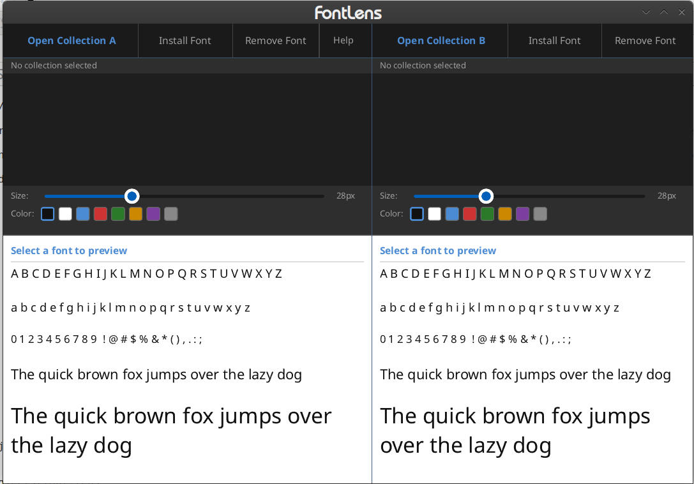

# FontLens

A lightweight font browser and comparison tool for Linux.

FontLens lets you browse to any directory and instantly preview the fonts inside — no database, no indexing, no activation state. Open two directories, compare fonts side by side, install what you want to `~/.fonts` with one click, and remove fonts you no longer want from your own collections.

---

```
Developer:  archerprojects
Contact:    archer.projects@proton.me
Maintainer: archerprojects <archer.projects@proton.me>
GitHub:     https://github.com/archerprojects/fontlens
```

Developed for Lean Linux. Not exclusive to Lean Linux — runs on any standard Linux desktop.

---

## Features

- **Two-panel comparison** — load independent font collections into each panel simultaneously
- **Built-in directory browser** — navigate the filesystem inside the app, including hidden directories like `~/.fonts`; folders are annotated with the number of fonts they contain, with an optional "folders with fonts only" filter
- **Live preview** — click any font to render a full specimen: uppercase, lowercase, numerals, punctuation, and pangrams at multiple sizes
- **Size slider** — scale the specimen from 8px to 72px per panel
- **Color swatches** — preview specimen text in 8 colors per panel
- **Install to ~/.fonts** — one click copies the selected font and runs `fc-cache`
- **Remove fonts** — permanently delete a font from `~/.fonts`, `~/.local/share/fonts`, or any external collection you own; system font directories are protected
- **DE-aware theming** — detects dark/light mode from GNOME, Cinnamon, KDE, XFCE, or `GTK_THEME`, and renders a full light or dark surface set accordingly
- **Zero footprint** — single binary, no GTK/Qt/WebKit runtime, no Flatpak, no portal dialog dependency

---

## Screenshots


*Two-panel font browser — browse, compare, and preview fonts from any directory.*

---

## Requirements

FontLens runs on any Linux distribution with a standard desktop stack. Runtime prerequisites (declared in the package and pulled in automatically by `dpkg`/`apt`):

- **fontconfig** — provides `fc-cache`, used when installing or removing fonts
- **xdg-utils** — provides `xdg-open`, used to open font directories in your file manager
- **libglib2.0-bin** — provides `gsettings`, used for dark/light theme detection

Building from source additionally requires the **Rust toolchain** (`cargo`).

---

## Installation

### From .deb (Debian / Ubuntu and derivatives)

```bash
sudo dpkg -i fontlens_1.0.0_amd64.deb
sudo apt-get install -f      # resolves dependencies if needed
```

### From source

```bash
git clone https://github.com/archerprojects/fontlens.git
cd fontlens
make
```

The build assembles the binary and a `.deb` into `dist/`. To produce just the binary: `cargo build --release` (output at `target/release/fontlens`).

---

## Usage

Launch FontLens from your application menu or run:

```bash
fontlens
```

- **Open Collection A / B** — opens the built-in browser; navigate to a directory and choose **Scan this folder** to load every font beneath it
- **Click any font** in the list to preview it
- **Size slider** — adjust specimen size
- **Color swatches** — change specimen text color
- **Install Font** — copies the selected font to `~/.fonts` and refreshes the font cache
- **Remove Font** — permanently deletes the selected font from disk (enabled for your own collections; system font paths are protected)

---

## Design principles

**No database.** FontLens reads directly from disk on every scan. Nothing is indexed, cached, or persisted between sessions.

**No activation.** There is no enable/disable state. Point at a directory — it shows what's there. Remove the pointer — nothing remains.

**No portal dialog.** The directory browser is built on plain filesystem reads, so it behaves identically on every desktop and reaches hidden directories the native file picker hides.

**Read everywhere, write where you own.** Fonts can be previewed from any readable path, including system directories. Installing writes to `~/.fonts` only; removal is allowed only where you own the files. System font directories cannot be modified from within the app.

**No runtime dependencies beyond the desktop basics.** Single Rust binary. No GTK, Qt, WebKit, or Flatpak runtime required.

---

## Supported formats

TTF and OTF. WOFF/WOFF2 planned for a future release.

---

## Built with

| Component | Library |
|---|---|
| UI | [Slint](https://slint.dev) |
| Font metadata | ttf-parser |
| Directory scanning | walkdir |

---

## License

GNU General Public License v3.0 — see [LICENSE](LICENSE) for full terms.

Copyright (C) 2026 archerprojects (archer.projects@proton.me)
